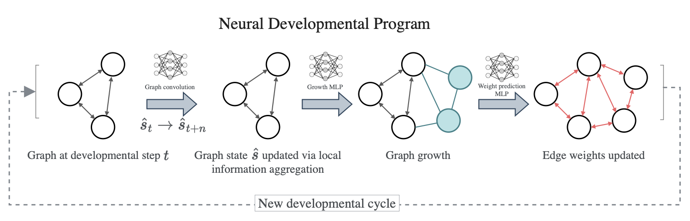

 
---

<div align="center">    
 
# Towards Self-Assembling Artificial Neural Networks through Neural Developmental Programs

[](https://arxiv.org/abs/2307.08197)

</div>
 
This reposistory contains the code to grow neural networks using the evolutionary version of the Neural Developmental Programs method described in our paper [Towards Self-Assembling Artificial Neural Networks through Neural Developmental Programs, 2023](https://direct.mit.edu/isal/proceedings/isal/35/80/116941). For the version using policy gradient see [here](https://github.com/enajx/NDP/tree/main/NDP-RL). 

A talk presenting the paper at the 2023 Artificial Life Conference can be found [here](https://www.youtube.com/watch?v=HG0ahbACTf0). 
<!-- 
<p align="center">
  
</p> -->



## How to run   
First, install dependencies.
```bash
# clone project   
git clone https://github.com/enajx/NDP   

# install dependencies   
cd NDP 
pip install -r requirements.txt
 ```   
 Next, use `train.py` and a experiment configuration file  `run_experiment.yaml`. To experiments_paper folder for examples of configuration files for different tasks. 
 
 ```bash
# train NDP to solve task defined in run_experiment.yaml, example is XOR gate
python train.py --config run_experiment.yaml
```

Once trained, use `evaluate_solution.py --id <run_id>`:
 ```python
python evaluate_solution.py --id 1645360631
```


## Citation   

If you use the code for academic or commecial use, please cite the associated paper:

```bibtex
@article{Najarro2023Jul,
	author = {Najarro, Elias and Sudhakaran, Shyam and Risi, Sebastian},
	title = {{Towards Self-Assembling Artificial Neural Networks through Neural Developmental Programs}},
	journal = {MIT Press},
	year = {2023},
	month = jul,
	publisher = {MIT Press},
	doi = {10.1162/isal_a_00697}
}
```   

## Disclamer

The current version of the code has not been optimised for speed and is solely intended as proof of concept. If you want to use it to grow big  networks, it's probably a good idea to implement functions using a high-performance libraries such as JAX/Jraph, Numba or Taichi.
